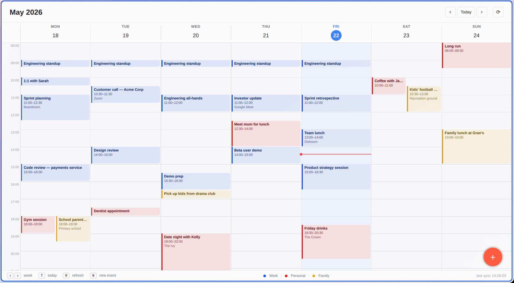

# quickcalendar

A lightweight calendar suite for Wayland that lives off plain **ICS feeds** — no
accounts, no sync daemon talking to Google's API, no Electron. Subscribe to the
secret-iCal URLs you already have (Google, iCloud, public sports schedules, …)
and quickcalendar gives you:

- **A week view** — a fast [Quickshell](https://quickshell.org) QML window with
  overlap-aware event packing, per-calendar colours, text zoom, and a "+" picker
  that punts to the right calendar's web UI to create events.
- **Background sync** — a one-minute systemd timer that fetches and caches your
  feeds and expands recurring events (RRULE).
- **Reminders** — desktop notifications for event `VALARM`s (`notify-send`).
- **A fullscreen alert** — when an event *starts*, a GTK4 layer-shell overlay
  takes over the screen with the title, time, location and a clickable meeting
  link. Hard to miss a meeting.



It ships as two commands:

| Command | What it is |
| --- | --- |
| `quickcalendar` | the calendar viewer (the window you open) |
| `quickcalendar-sync` | the background agent (sync, reminders, fullscreen alerts) — normally driven by the systemd timer, not run by hand |

> Built and daily-driven on Arch + Hyprland. Anything with a `wlr-layer-shell`
> compositor and Quickshell should work; patches welcome.

## Install

```sh
git clone https://github.com/andyjeffries/quickcalendar.git
cd quickcalendar
./install.sh
```

That copies the binaries to `~/.local/bin`, the QML to
`~/.local/share/quickcalendar`, the systemd units to `~/.config/systemd/user`,
a `.desktop` entry to your launcher, seeds `~/.config/quickcalendar/calendars.txt`
from the example, and enables `quickcalendar-sync.timer`.

Then add your feeds and open it:

```sh
$EDITOR ~/.config/quickcalendar/calendars.txt
quickcalendar-sync refresh     # fetch now instead of waiting for the timer
quickcalendar                  # open the week view
```

### Install modes

```sh
./install.sh            # copy files into place (default)
./install.sh --link     # symlink back to this checkout (repo = source of truth;
                        # `git pull` then updates the live install)
./install.sh --uninstall
```

Paths can be overridden with env vars, e.g. `BINDIR=~/bin ./install.sh`. See the
top of `install.sh` for the full list.

## Dependencies

- [`quickshell`](https://quickshell.org) — the viewer and its renderer
- `python3` + [`python-dateutil`](https://pypi.org/project/python-dateutil/) — feed parsing & recurrence expansion
- `gtk4`, `gtk4-layer-shell`, `python-gobject` — the fullscreen alert overlay
- `libnotify` (`notify-send`) — reminder notifications
- `xdg-utils` (`xdg-open`) — opening meeting/event links

**Arch:**

```sh
sudo pacman -S --needed quickshell python-dateutil gtk4 gtk4-layer-shell \
  python-gobject libnotify xdg-utils
```

(`install.sh` runs a dependency check and tells you what's missing — it won't
abort, since the viewer still works without the GTK4 alert pieces.)

## Configuring feeds

`~/.config/quickcalendar/calendars.txt` is one ICS URL per line, with optional
`# tag: value` lines directly above a URL. The seeded file documents every tag;
the essentials:

```ini
# name: Work
# colour: #3b82f6
https://calendar.google.com/calendar/ical/you%40example.com/private-abc123/basic.ics

# name: Formula 1
# colour: #e11d48
# readonly: true
https://ics.ecal.com/.../Formula%201.ics
```

- `name:` — display label
- `colour:` — event chip colour (any CSS hex)
- `readonly:` — render the feed but hide it from the "+" create-event picker
- `add_event_url:` / `add_group:` — where the "+" picker sends you to create
  events (sensible defaults for Google and iCloud)

Getting a secret ICS URL:

- **Google Calendar** → Settings → *[your calendar]* → Integrate calendar →
  *Secret address in iCal format*
- **iCloud** → Calendar app → right-click a calendar → Share → *Public Calendar*
  → copy the `webcal://` URL (quickcalendar rewrites it to `https://`)

## How it works

```
                 ~/.config/quickcalendar/calendars.txt   (your feeds)
                                  │
   quickcalendar-sync.timer ──► quickcalendar-sync check  (every minute)
                                  │   fetch + cache ICS, expand RRULE
                                  ├─► event starting now? ─► fullscreen overlay
                                  └─► VALARM due?         ─► notify-send reminder

   quickcalendar (viewer) ──► quickcalendar-sync list --json ─► week grid
```

The sync agent caches each feed under `~/.local/state/quickcalendar/` (5-minute
freshness, falls back to stale cache if a fetch fails) and records fired events
in `fired.json` so an alert never double-fires across ticks.

## Compositor notes (optional)

quickcalendar needs **no special compositor configuration**. The fullscreen
event alert uses the `wlr-layer-shell` overlay layer (it sits above everything
on its own), and the viewer is an ordinary floating window — both just work on
any `wlr-layer-shell` compositor.

If you're on Hyprland and want to bind a key or pin the viewer's placement,
here are two optional niceties:

```conf
# Open the week view on a keybind
bind = SUPER, C, exec, quickcalendar

# Float + size the viewer. IMPORTANT: match on the title too — the class
# `org.quickshell` is shared by every Quickshell surface (your bar, etc.),
# so a class-only rule would also catch unrelated windows.
windowrulev2 = float, class:^(org\.quickshell)$, title:^(Calendar View)$
windowrulev2 = size 1180 780, class:^(org\.quickshell)$, title:^(Calendar View)$
```

(Window-rule syntax shifts between Hyprland versions — adjust `windowrulev2` /
`match:` to match yours.)

## Uninstall

```sh
./install.sh --uninstall
```

Removes the binaries, units, QML and `.desktop` entry, and disables the timer.
Your `calendars.txt` and cache are left in place.

## License

MIT — see [LICENSE](LICENSE).
